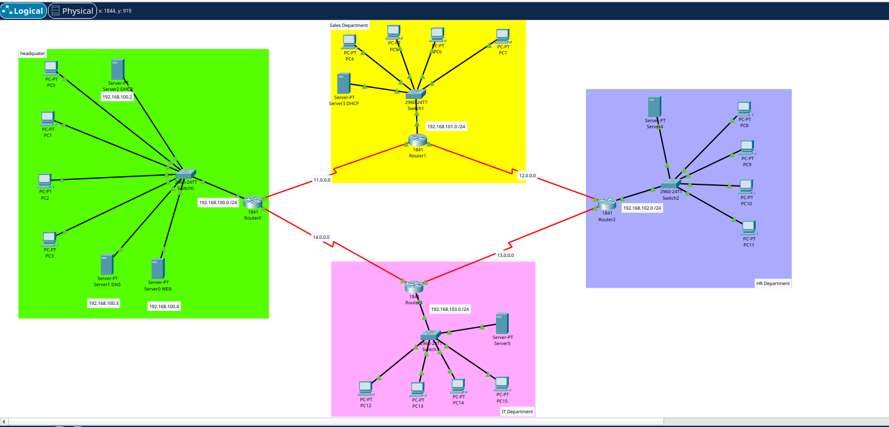

# Multibranch Office Network - University Assignment

## Overview
This project implements a multibranch office network configuration and management system as part of a university assignment.



## Features
- Network architecture for multiple office branches
- Configuration management
- Network connectivity and communication

## Project Structure
```
Multibranch_office_Network_uniAssignment/
├── README.md
└── [Additional project files]
```

## Getting Started

### Prerequisites
- Cisco Packet Tracer

### Installation
1. Clone the repository
```bash
git clone https://github.com/tabassat/Multibranch_office_Network_uniAssignment.git
```

2. Navigate to the project directory
```bash
cd Multibranch_office_Network_uniAssignment
```


## Documentation
For more detailed information, refer to the project documentation.

## Author
tabassat


## Notes
This is a university assignment project.
